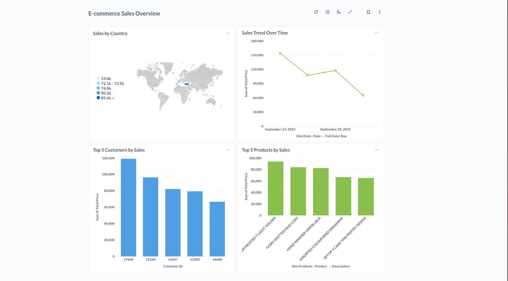
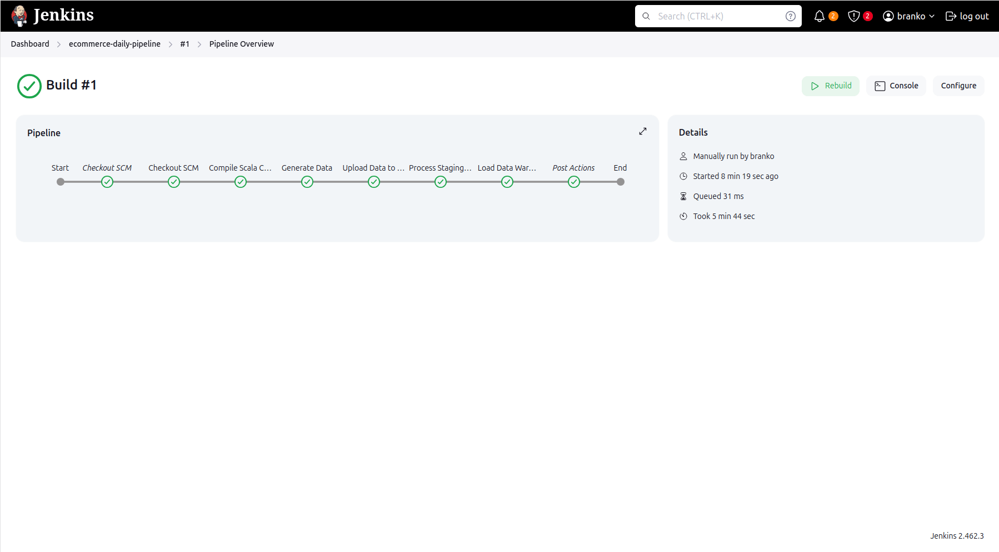
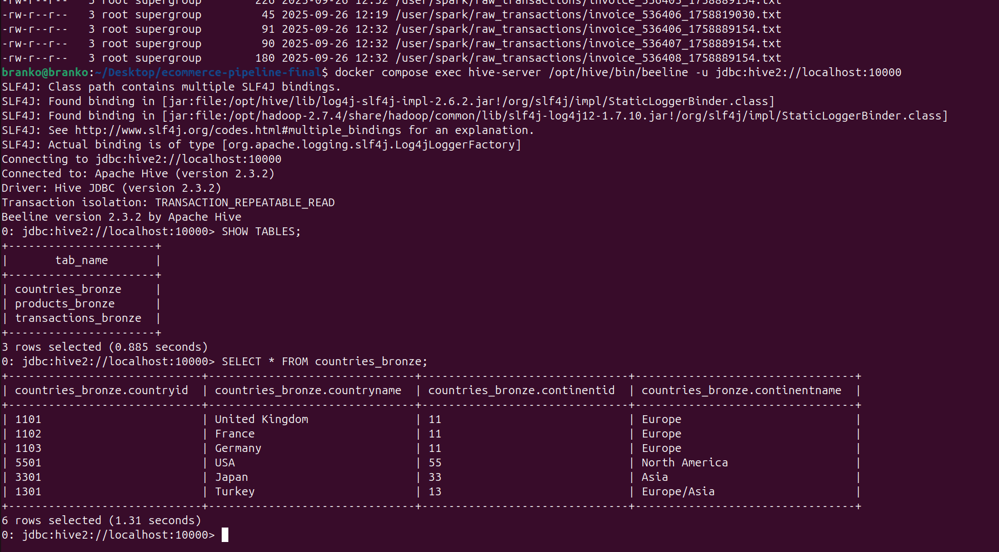
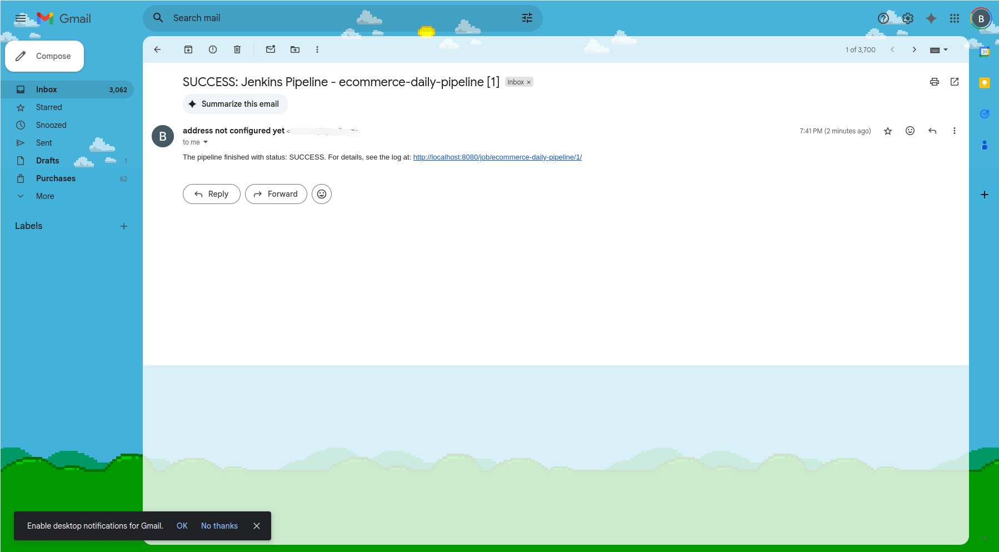

# E-commerce Data Pipeline

## Overview

This is an end-to-end data engineering project that simulates a complete batch processing lifecycle for an e-commerce platform, with data originating from its user-facing mobile application. The pipeline automates data generation, storage in a Data Lake (HDFS), processing and transformation with Spark and Hive, orchestration with Jenkins, and final visualization in a BI dashboard using Metabase.

A key feature of this project is a robust, two-tiered alerting system that sends both technical failure notifications and specific business logic alerts for high-quantity orders, demonstrating a proactive approach to data monitoring.

## Project Phases

This project was developed in distinct phases, managed via Jira:

-   **Phase I: Infrastructure Setup (EP-1):** The initial phase focused on building the entire project environment using Docker and Docker Compose. This included setting up a Spark Cluster, HDFS Data Lake, Hive Metastore with a PostgreSQL backend, a separate PostgreSQL Data Warehouse, Jenkins, and Metabase.

-   **Phase II: Bronze Layer Processing & Data Quality (EP-2, EP-3, EP-4, EP-10):** This phase involved developing the initial Spark (Scala) jobs to ingest raw data from HDFS, clean it, apply a schema, and save it into structured, Parquet-formatted tables in Hive (Bronze Layer). This phase was later enhanced with a **data quality check (EP-10)** to identify and quarantine transactions with invalid data, ensuring the integrity of the data entering the warehouse.

-   **Phase III: Gold Layer Processing (EP-5):** A main ETL Spark job was created to read from the clean Bronze layer, perform joins and transformations to build a dimensional Star Schema, and load the final, clean data into the PostgreSQL Data Warehouse (Gold Layer).

-   **Phase IV: Orchestration & Alerting (EP-6, EP-7, EP-9):** Jenkins was configured to create a full CI/CD pipeline with two separate automated jobs: a **main daily job (EP-6)** for the full ETL process, and a **4-hourly job (EP-9)** for frequent transaction ingestion. This phase also included implementing both technical failure email notifications and a business logic alert based on statistical anomaly detection **(EP-7)**.

-   **Phase V: BI & Visualization (EP-8):** The final core phase involved connecting Metabase to the PostgreSQL Data Warehouse and building an interactive dashboard to answer key business questions about sales, products, and customers.

## DevOps & Maintenance (EP-11)

To ensure the reliability and efficiency of the pipeline, two key DevOps practices were implemented as part of the project's improvement phase.

### Backup Strategy
A fully automated backup system was created. A dedicated Jenkins pipeline (`backup-pipeline`) runs weekly, executing a shell script (`scripts/run_backup.sh`) that creates timestamped backups of both the PostgreSQL Data Warehouse and the HDFS Data Lake.

The generated backup files are not stored on the local filesystem. Instead, they are archived as **Jenkins Build Artifacts**. They can be downloaded directly from the specific build page in the Jenkins UI for safekeeping or restoration.

### Performance Analysis
A performance analysis of the main ETL job (`LoadDWH`) was conducted using the Spark UI to identify potential bottlenecks.
-   **Methodology:** The "Stages" tab in the Spark UI was used to review the duration and data shuffling metrics for each step of the Spark job.
-   **Key Observation:** The longest-running stages are those involving joins and aggregations on the `fct_sales` table, which is expected. A potential future optimization could be to partition the Hive tables by date to reduce the amount of data scanned during the daily load.

## Architecture

## Technology Stack

-   **Containerization:** Docker, Docker Compose
-   **Orchestration:** Jenkins
-   **Data Lake:** Hadoop Distributed File System (HDFS)
-   **Staging / Metastore:** Apache Hive
-   **Data Processing:** Apache Spark (using Scala)
-   **Data Warehouse:** PostgreSQL
-   **BI / Visualization:** Metabase
-   **Languages:** Scala, Python, Shell Scripting, Groovy

## Data Model: Star Schema

The project's goal is to produce a clean, dimensional **Star Schema** in the PostgreSQL Data Warehouse, optimized for analytical queries.

## Key Feature: Automated Alerting System

A key feature of this pipeline is its two-tiered alerting system, orchestrated by Jenkins:

1.  **Technical Failure Alerts:** If any stage of the Jenkins pipeline fails, an immediate email notification is sent, allowing for rapid debugging and recovery.
2.  **Business Logic Alerts:** The main Spark ETL job (`load_dwh.scala`) contains specific logic to identify business anomalies. It calculates the median and standard deviation of the quantity for each product and flags any transaction where the quantity is more than two standard deviations above the median. If such an order is found, a special "High-Value Order Alert" email is sent to stakeholders.

This dual system ensures both technical stability and proactive business monitoring.

## Final Dashboard & Screenshots

### 1. E-commerce Sales Overview Dashboard

This dashboard, built in Metabase, provides a high-level overview of business performance, answering key questions from the project's Yellow Phase.

### 2. Technical Components

| Jenkins Pipeline View | Spark UI (Applications) |
| :---: | :---: |
|  |  |
| A successful run of the `ecommerce-daily-pipeline`. | The Spark Master UI showing completed applications. |

| HDFS Data Lake (Raw Layer) | Hive Tables (Bronze Layer) |
| :---: | :---: |
|  |  |
| Terminal output showing raw files in HDFS. | The Hive Beeline client showing the structured bronze tables. |

### 3. Project Management & Alerting

| Jira Project Board | SUCCESS Email | ALERT Email |
| :---: | :---: | :---: |
|  |  |  |
| The Jira board showing the completed project phases. | Example of an automated SUCCESS email. | Example of a high-value order ALERT email. |

## How to Run

For detailed, step-by-step instructions on how to set up the environment and run the entire pipeline from scratch, please see the:

### ➡️ **[Setup Guide](SETUP_GUIDE.md)**